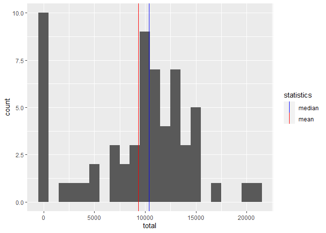
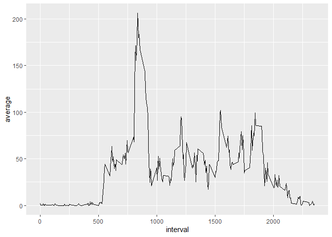
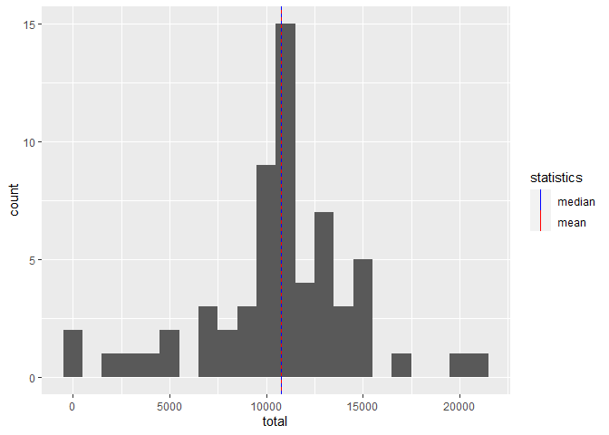
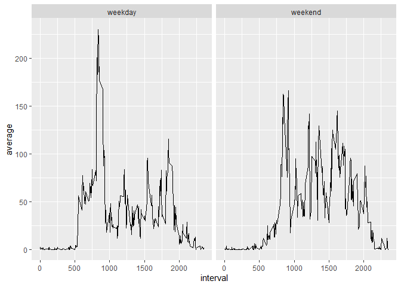

# Introduction

It is now possible to collect a large amount of data about personal movement using activity monitoring devices such as a Fitbit, Nike Fuelband, or Jawbone Up. These type of devices are part of the “quantified self” movement – a group of enthusiasts who take measurements about themselves regularly to improve their health, to find patterns in their behavior, or because they are tech geeks. But these data remain under-utilized both because the raw data are hard to obtain and there is a lack of statistical methods and software for processing and interpreting the data.

This assignment makes use of data from a personal activity monitoring device. This device collects data at 5 minute intervals through out the day. The data consists of two months of data from an anonymous individual collected during the months of October and November, 2012 and include the number of steps taken in 5 minute intervals each day.

The data for this assignment can be downloaded from the course web site:

Dataset: [Activity monitoring data](https://d396qusza40orc.cloudfront.net/repdata%2Fdata%2Factivity.zip) `[52K]`

The variables included in this dataset are:

- **steps**: Number of steps taking in a 5-minute interval (missing values are coded as *NA*)

- **date**: The date on which the measurement was taken in YYYY-MM-DD format

- **interval**: Identifier for the 5-minute interval in which measurement was taken

The dataset is stored in a comma-separated-value (CSV) file and there are a total of 17,568 observations in this dataset.


```r
  fileUrl <- 
    "https://d396qusza40orc.cloudfront.net/repdata%2Fdata%2Factivity.zip"
  fileName <- "./activity.zip"
  file <- "./activity.csv"

  if(!file.exists(fileName)) {
    download.file(fileUrl, destfile = fileName, method = "curl")  
  }
  if(!file.exists(file)) {
    unzip(fileName)
  }
```

# Review criteria

Repo

1. Valid GitHub URL 

2. At least one commit beyond the original fork

3. Valid SHA-1

4. SHA-1 corresponds to a specific commit

Commit containing full submission

1. Code for reading in the dataset and/or processing the data

2. Histogram of the total number of steps taken each day

3. Mean and median number of steps taken each day

4. Time series plot of the average number of steps taken

5. The 5-minute interval that, on average, contains the maximum number of steps

6. Code to describe and show a strategy for imputing missing data

7. Histogram of the total number of steps taken each day after missing values are imputed

8. Panel plot comparing the average number of steps taken per 5-minute interval across weekdays and weekends

9. All of the R code needed to reproduce the results (numbers, plots, etc.) in the report

# Assignment

This assignment will be described in multiple parts. You will need to write a report that answers the questions detailed below. Ultimately, you will need to complete the entire assignment in a single R markdown document that can be processed by knitr and be transformed into an HTML file.

Throughout your report make sure you always include the code that you used to generate the output you present. When writing code chunks in the R markdown document, always use *echo = TRUE* so that someone else will be able to read the code. This assignment will be evaluated via peer assessment so it is essential that your peer evaluators be able to review the code for your analysis.

For the plotting aspects of this assignment, feel free to use any plotting system in R (i.e., base, lattice, ggplot2)

Fork/clone the GitHub repository created for this assignment. You will submit this assignment by pushing your completed files into your forked repository on GitHub. The assignment submission will consist of the URL to your GitHub repository and the SHA-1 commit ID for your repository state.

NOTE: The GitHub repository also contains the dataset for the assignment so you do not have to download the data separately.

## Loading and preprocessing the data

Show any code that is needed to

1. Load the data (i.e. *read.csv()*)

Process/transform the data (if necessary) into a format suitable for your analysis


```r
  activity <- read.csv(file)
  activity$date <- as.Date(activity$date)
```

## What is mean total number of steps taken per day?

For this part of the assignment, you can ignore the missing values in the dataset.

Calculate the total number of steps taken per day

If you do not understand the difference between a histogram and a barplot, research the difference between them. Make a histogram of the total number of steps taken each day

Calculate and report the mean and median of the total number of steps taken per day


```r
  suppressPackageStartupMessages(library(dplyr))
  steps <- activity %>%
    group_by(date) %>%
    summarise(total=sum(steps,na.rm=TRUE))
  
  mean <- mean(steps$total)
  median <- median(steps$total)

  library(ggplot2)
  ggplot(steps,aes(total)) + geom_histogram(binwidth=1000) +
    geom_vline(aes(xintercept= mean, color="mean")) +
    geom_vline(aes(xintercept = median, color = "median")) +
    scale_color_manual(name = "statistics", values = c(median = "blue", mean = "red"))
```

<!-- -->

**Mean of steps taken per day is 9354 and Median is 10395**

## What is the average daily activity pattern?

Make a time series plot (i.e. *type = "l"*) of the 5-minute interval (x-axis) and the average number of steps taken, averaged across all days (y-axis)

Which 5-minute interval, on average across all the days in the dataset, contains the maximum number of steps?


```r
  steps2 <- activity %>%
    group_by(interval) %>%
    summarise(average=mean(steps,na.rm=TRUE))
  
  max_interval<-steps2$interval[which.max(steps2$average)]

  ggplot(steps2,aes(interval,average)) + geom_line()
```

<!-- -->

**The maximum number of steps in average is in interval 835**

## Imputing missing values

Note that there are a number of days/intervals where there are missing values *NA*. The presence of missing days may introduce bias into some calculations or summaries of the data.

Calculate and report the total number of missing values in the dataset (i.e. the total number of rows with *NA*s)

Devise a strategy for filling in all of the missing values in the dataset. The strategy does not need to be sophisticated. For example, you could use the mean/median for that day, or the mean for that 5-minute interval, etc.

Create a new dataset that is equal to the original dataset but with the missing data filled in.

Make a histogram of the total number of steps taken each day and Calculate and report the mean and median total number of steps taken per day. Do these values differ from the estimates from the first part of the assignment? What is the impact of imputing missing data on the estimates of the total daily number of steps?


```r
  # join original file with the file containing the average per interval
  suppressMessages(activity3<-left_join(activity,steps2,x.by=interval,y.by=interval))

  # replace the cases having NA with the average of the other days in the same interval
  na_cases <- is.na(activity3$steps)
  activity3$steps[na_cases]<-activity3$average[na_cases]
  
  steps3 <- activity3 %>%
    group_by(date) %>%
    summarise(total=sum(steps))
  
  mean3 <- mean(steps3$total)
  median3 <- median(steps3$total)

  ggplot(steps3,aes(total)) + geom_histogram(binwidth=1000) +
    geom_vline(aes(xintercept= mean3, color="mean")) +
    geom_vline(aes(xintercept = median3, color = "median"),linetype="dashed") +
    scale_color_manual(name = "statistics", values = c(median = "blue", mean = "red"))
```

<!-- -->

**New Mean of steps taken per day is 10766 and New Median is 10766**

**Now Mean and Median are higher than before, as NAs were replaced by steps not existing before (so, steps added)**

## Are there differences in activity patterns between weekdays and weekends?

For this part the *weekdays()* function may be of some help here. Use the dataset with the filled-in missing values for this part.

Create a new factor variable in the dataset with two levels – “weekday” and “weekend” indicating whether a given date is a weekday or weekend day.

Make a panel plot containing a time series plot (i.e. *type = "l"*) of the 5-minute interval (x-axis) and the average number of steps taken, averaged across all weekday days or weekend days (y-axis). See the README file in the GitHub repository to see an example of what this plot should look like using simulated data.


```r
  activity3$typeOfDay<-"weekday"
  activity3$typeOfDay[grepl("S(at|un)", weekdays(activity3$date))]<-"weekend"

  steps4 <- activity3 %>%
    group_by(interval,typeOfDay) %>%
    summarise(average=mean(steps,na.rm=TRUE),.groups="keep")

  ggplot(steps4,aes(interval,average)) + geom_line() +
    facet_grid(.~typeOfDay)
```

<!-- -->

**weekday activity starts early, has a peek around interval 800 and moderate activity during the day, weekend activity starts later, without the intitial peek, but higher activty during the day, additionally activity ends later**
